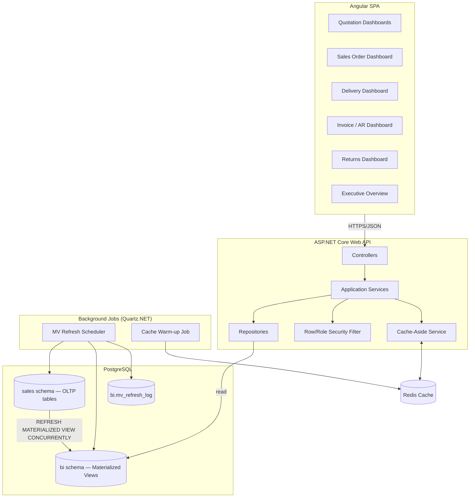

# Sales Quotation BI Module

BI/reporting layer for Sale Quotations — pipeline, conversion, and aging dashboards on top of the existing ERP sales schema.

## Stack

- Frontend: Angular + AG Grid / PrimeNG / ApexCharts
- Backend: ASP.NET Core
- Database: PostgreSQL (materialized views)
- Cache: Redis

## Docs

- Requirements: [`docs/requirements`](docs/requirements)
- Plans: [`docs/plans`](docs/plans)

## Reference

[Full Implementation Proposal](https://claude.ai/code/artifact/334a1a11-678d-4f64-9342-a24ed2bcf5f8?via=auto_preview)

---

# Sales & Delivery BI Module — Implementation Proposal & Technical Architecture

**Version:** 1.0
**Date:** 02 August 2026
**Scope:** Full order-to-cash pipeline — Sale Quotations, Sales Orders, Delivery/Challan, Sales Invoice, Return/Credit Note
**Stack:** ASP.NET Core (plain layered, no ABP) · Angular + AG Grid · PostgreSQL (materialized views) · Redis
**Source Spec:** `Sales_Delivery_Module_BI_Developer_Guidelines.md` (v1.0)

---

## 1. Executive Summary

This proposal turns the BI Developer Guidelines into a buildable system covering all five sub-modules of the Sales & Delivery pipeline. Sale Quotations remains the priority (fully specified in the source doc); the other four sub-modules did not have MVs, dashboards, or APIs defined, so this document extends the same pattern to them for architectural consistency and to satisfy the "full pipeline" scope.

The system is a **read-optimized BI layer on top of the existing OLTP schema**: PostgreSQL materialized views pre-aggregate transactional data, Redis caches the views' query results per filter combination, and a thin ASP.NET Core API layer serves Angular/AG Grid dashboards under role- and unit-based row-level security.

---

## 2. Scope & Objectives

| Sub-Module | BI Priority | This Proposal Delivers |
|---|---|---|
| Sale Quotations | Very High | 3 dashboards, 1 primary + 2 supporting MVs, 5 API endpoints (per source spec) |
| Sales Orders | High | 1 dashboard, 1 MV, 4 API endpoints |
| Delivery / Challan | High | 1 dashboard, 2 MVs (summary + on-time performance), 4 API endpoints |
| Sales Invoice | Medium-High | 1 dashboard, 2 MVs (summary + AR aging), 4 API endpoints |
| Return / Credit Note | Medium | 1 dashboard, 1 MV, 3 API endpoints |
| Executive Overview | — | Cross-module funnel MV + 6 KPI feeds |

**Out of scope:** OLTP transaction entry screens (quotation/order/delivery creation UI) — this is a **reporting/BI layer only**, reading from an assumed existing (or parallel-built) transactional schema.

---

## 3. Business Process Coverage

```
Sale Quotation → Sales Order → Delivery/Challan → Sales Invoice
      ↓                                                  ↓
  Rejected/Expired/Lost                          Return / Credit Note
```

| Stage | Key BI Question |
|---|---|
| Quotation | Pipeline value, conversion rate, aging, win/loss by buyer |
| Sales Order | Order backlog, order-to-delivery lead time, fulfillment % |
| Delivery | On-time delivery rate, delayed shipments, delivery value by buyer/unit |
| Invoice | Invoiced value vs delivered value, AR aging, DSO (days sales outstanding) |
| Return | Return rate (value & qty), top return reasons, return impact on revenue |

---

## 4. Solution Architecture



**Layering rule (per engineering standard):** Controllers never touch `DbContext`/SQL directly. Controller → AppService → Repository → EF Core/Dapper. DTOs cross the AppService boundary; entities never leave the repository layer.

---

## 5. Technology Stack

| Layer | Choice | Notes |
|---|---|---|
| Frontend | Angular 17+, AG Grid (Community, upgrade to Enterprise if pivoting/grouping needed), ApexCharts (`ng-apexcharts`) | Grid-heavy dashboards match AG Grid's strength |
| API | ASP.NET Core 8, minimal-API or MVC controllers | Async all the way, no `.Result`/`.Wait()` |
| ORM/Data access | EF Core for OLTP writes (not in this BI scope), **Dapper** for MV reads | MVs are flat/denormalized — Dapper avoids EF tracking overhead on read-only aggregates |
| Database | PostgreSQL 15+ | Native `MATERIALIZED VIEW`, `pg_cron` for scheduled refresh |
| Cache | Redis (StackExchange.Redis) | Cache-aside pattern, per-filter-hash keys |
| Background jobs | Quartz.NET (in-process) or `pg_cron` (in-DB) for MV refresh | See §7.5 for trade-off |
| Auth | JWT bearer + ASP.NET Core policy-based authorization | Role claims + unit claims embedded in token |
| Export | Server-side Excel generation (ClosedXML) for grids >5,000 rows | Client-side AG Grid export only for small result sets |

---

## 6. Database Architecture

### 6.1 Schema Strategy

Two PostgreSQL schemas:

- **`sales`** — OLTP source of truth (assumed to exist or built alongside; owned by the transactional module, not this BI layer).
- **`bi`** — materialized views + refresh metadata, owned by this BI module. Nothing in `bi` is ever written to directly by the API — only `REFRESH MATERIALIZED VIEW` touches it.

### 6.2 Core OLTP Tables (minimum needed to drive the MVs)

```sql
sales.units               (unit_id PK, unit_name, unit_type)
sales.buyers               (buyer_id PK, buyer_name)
sales.merchandisers        (merchandiser_id PK, merchandiser_name, unit_id FK)
sales.users                (user_id PK, user_name, role_id FK)
sales.user_units           (user_id FK, unit_id FK)              -- row-level security join
sales.fx_rates             (currency_code, rate_date, rate_to_usd)

sales.quotations           (quotation_id PK, quotation_no, quotation_date, buyer_id FK,
                            merchandiser_id FK, unit_id FK, style_no, season,
                            currency_code, value, status, status_date,
                            converted_so_id FK NULL, converted_date NULL,
                            lost_reason NULL, created_by, created_at)

sales.sales_orders         (so_id PK, so_no, so_date, quotation_id FK NULL, buyer_id FK,
                            merchandiser_id FK, unit_id FK, currency_code, value,
                            status, promised_delivery_date, created_at)

sales.deliveries           (delivery_id PK, challan_no, delivery_date, so_id FK,
                            buyer_id FK, unit_id FK, delivered_qty, delivered_value,
                            promised_date, status, created_at)

sales.sales_invoices       (invoice_id PK, invoice_no, invoice_date, delivery_id FK,
                            so_id FK, buyer_id FK, unit_id FK, currency_code,
                            invoice_value, due_date, paid_amount, status, created_at)

sales.sales_returns        (return_id PK, return_no, return_date, invoice_id FK,
                            buyer_id FK, unit_id FK, return_value, return_qty,
                            reason_code, created_at)
```

All monetary MVs store a `*_value_usd` column computed via `sales.fx_rates` at MV-build time — **flag as an open dependency**: FX conversion logic and rate-source ownership must be confirmed with Finance before Phase 1 sign-off.

### 6.3 Materialized Views — Sale Quotations (per source spec, §3)

```sql
CREATE MATERIALIZED VIEW bi.mv_sales_quotation_summary AS
SELECT
    q.quotation_id,
    q.quotation_no,
    q.quotation_date,
    q.buyer_id,               b.buyer_name,
    q.merchandiser_id,        m.merchandiser_name,
    q.unit_id,                u.unit_name,
    q.style_no, q.season,
    q.currency_code,
    q.value * fx.rate_to_usd  AS quotation_value_usd,
    q.status,
    q.status_date,
    (CURRENT_DATE - q.status_date)  AS days_in_status,
    (COALESCE(q.converted_date, CURRENT_DATE) - q.quotation_date) AS days_open,
    so.so_no                  AS converted_to_so_no,
    q.converted_date,
    (q.converted_date - q.quotation_date) AS conversion_days,
    q.lost_reason,
    q.created_by,
    now()                     AS last_refresh_date
FROM sales.quotations q
JOIN sales.buyers b          ON b.buyer_id = q.buyer_id
JOIN sales.merchandisers m   ON m.merchandiser_id = q.merchandiser_id
JOIN sales.units u           ON u.unit_id = q.unit_id
LEFT JOIN sales.sales_orders so ON so.so_id = q.converted_so_id
LEFT JOIN sales.fx_rates fx  ON fx.currency_code = q.currency_code
                             AND fx.rate_date = q.quotation_date;

CREATE UNIQUE INDEX ux_mv_quotation_summary ON bi.mv_sales_quotation_summary (quotation_id);
```

`MV_QUOTATION_PIPELINE_DAILY` and `MV_QUOTATION_CONVERSION_RATE` follow the same pattern as daily/monthly rollups of the above (grouped by `status`, `buyer_id`/`merchandiser_id`, `date_trunc('month', quotation_date)`).

### 6.4 Materialized Views — remaining sub-modules

```sql
-- Sales Orders: backlog + fulfillment tracking
CREATE MATERIALIZED VIEW bi.mv_sales_order_summary AS
SELECT so.so_id, so.so_no, so.so_date, so.buyer_id, b.buyer_name,
       so.unit_id, u.unit_name, so.value * fx.rate_to_usd AS order_value_usd,
       so.status, so.promised_delivery_date,
       COALESCE(SUM(d.delivered_value), 0) * fx.rate_to_usd AS delivered_value_usd,
       (so.value - COALESCE(SUM(d.delivered_value), 0)) * fx.rate_to_usd AS pending_value_usd,
       now() AS last_refresh_date
FROM sales.sales_orders so
JOIN sales.buyers b ON b.buyer_id = so.buyer_id
JOIN sales.units u  ON u.unit_id = so.unit_id
LEFT JOIN sales.deliveries d ON d.so_id = so.so_id
LEFT JOIN sales.fx_rates fx ON fx.currency_code = so.currency_code AND fx.rate_date = so.so_date
GROUP BY so.so_id, b.buyer_name, u.unit_name, fx.rate_to_usd;

CREATE UNIQUE INDEX ux_mv_so_summary ON bi.mv_sales_order_summary (so_id);

-- Delivery: on-time performance
CREATE MATERIALIZED VIEW bi.mv_delivery_performance AS
SELECT d.delivery_id, d.challan_no, d.delivery_date, d.so_id, d.buyer_id, b.buyer_name,
       d.unit_id, u.unit_name, d.delivered_value * fx.rate_to_usd AS delivered_value_usd,
       d.promised_date,
       (d.delivery_date - d.promised_date) AS delay_days,
       CASE WHEN d.delivery_date <= d.promised_date THEN 'On-Time' ELSE 'Late' END AS delivery_status,
       now() AS last_refresh_date
FROM sales.deliveries d
JOIN sales.buyers b ON b.buyer_id = d.buyer_id
JOIN sales.units u  ON u.unit_id = d.unit_id
LEFT JOIN sales.fx_rates fx ON fx.rate_date = d.delivery_date;

CREATE UNIQUE INDEX ux_mv_delivery_perf ON bi.mv_delivery_performance (delivery_id);

-- Invoice + AR aging
CREATE MATERIALIZED VIEW bi.mv_sales_invoice_summary AS
SELECT i.invoice_id, i.invoice_no, i.invoice_date, i.buyer_id, b.buyer_name,
       i.unit_id, u.unit_name, i.invoice_value * fx.rate_to_usd AS invoice_value_usd,
       i.paid_amount * fx.rate_to_usd AS paid_amount_usd,
       (i.invoice_value - i.paid_amount) * fx.rate_to_usd AS outstanding_usd,
       i.due_date,
       GREATEST(CURRENT_DATE - i.due_date, 0) AS days_overdue,
       CASE
           WHEN i.paid_amount >= i.invoice_value THEN 'Paid'
           WHEN CURRENT_DATE > i.due_date THEN 'Overdue'
           ELSE 'Current'
       END AS ar_status,
       now() AS last_refresh_date
FROM sales.sales_invoices i
JOIN sales.buyers b ON b.buyer_id = i.buyer_id
JOIN sales.units u  ON u.unit_id = i.unit_id
LEFT JOIN sales.fx_rates fx ON fx.rate_date = i.invoice_date;

CREATE UNIQUE INDEX ux_mv_invoice_summary ON bi.mv_sales_invoice_summary (invoice_id);

-- Returns
CREATE MATERIALIZED VIEW bi.mv_sales_return_summary AS
SELECT r.return_id, r.return_no, r.return_date, r.buyer_id, b.buyer_name,
       r.unit_id, u.unit_name, r.return_value * fx.rate_to_usd AS return_value_usd,
       r.return_qty, r.reason_code, now() AS last_refresh_date
FROM sales.sales_returns r
JOIN sales.buyers b ON b.buyer_id = r.buyer_id
JOIN sales.units u  ON u.unit_id = r.unit_id
LEFT JOIN sales.fx_rates fx ON fx.rate_date = r.return_date;

CREATE UNIQUE INDEX ux_mv_return_summary ON bi.mv_sales_return_summary (return_id);

-- Cross-module funnel, feeds Executive Overview
CREATE MATERIALIZED VIEW bi.mv_sales_funnel_summary AS
SELECT unit_id, date_trunc('month', quotation_date) AS period,
       SUM(quotation_value_usd)                                   AS pipeline_value,
       SUM(quotation_value_usd) FILTER (WHERE status='Converted')  AS won_value,
       SUM(quotation_value_usd) FILTER (WHERE status IN ('Rejected','Expired')) AS lost_value
FROM bi.mv_sales_quotation_summary
GROUP BY unit_id, date_trunc('month', quotation_date);
```

### 6.5 MV Refresh Orchestration

PostgreSQL has no incremental "fast refresh" like Oracle — every refresh is a full rebuild. Two safe patterns, both required:

1. **`CREATE UNIQUE INDEX` on every MV's natural key** (done above) — this is what enables `REFRESH MATERIALIZED VIEW CONCURRENTLY`, which does **not** lock the view against reads. Without the unique index, refresh takes an `ACCESS EXCLUSIVE` lock and dashboards will hang mid-refresh.
2. **`bi.mv_refresh_log`** table (`mv_name, started_at, finished_at, status, rows_affected, error_message`) written by every refresh job run — gives the "Data as of" timestamp shown on every screen (§4.5 of source spec) and lets ops alert on stale/failed refreshes.

```sql
CREATE TABLE bi.mv_refresh_log (
    id BIGSERIAL PRIMARY KEY,
    mv_name TEXT NOT NULL,
    started_at TIMESTAMPTZ NOT NULL,
    finished_at TIMESTAMPTZ,
    status TEXT NOT NULL DEFAULT 'RUNNING',
    rows_affected BIGINT,
    error_message TEXT
);
```

Scheduling: use **`pg_cron`** for the refresh itself (it runs inside Postgres, survives API restarts, and needs no extra infra) — `SELECT cron.schedule('refresh_quotation_mv', '*/3 * * * *', $$REFRESH MATERIALIZED VIEW CONCURRENTLY bi.mv_sales_quotation_summary$$);`. Use **Quartz.NET in the API process** only for jobs that need to also touch Redis (cache warm-up right after refresh) — a pure-SQL job has no business living in the app tier.

| MV | Refresh Cadence | Rationale |
|---|---|---|
| mv_sales_quotation_summary | 3 min | Matches pipeline dashboard TTL |
| mv_quotation_pipeline_daily | 15 min | Daily snapshot, doesn't need to-the-minute freshness |
| mv_quotation_conversion_rate | 15 min | Monthly aggregate, low volatility |
| mv_sales_order_summary | 5 min | Backlog changes moderately fast |
| mv_delivery_performance | 5 min | Operational dashboard |
| mv_sales_invoice_summary | 10 min | AR aging doesn't need sub-10-min freshness |
| mv_sales_return_summary | 15 min | Low-frequency events |
| mv_sales_funnel_summary | 15 min | Executive-level, monthly grain |

---

## 7. API Architecture

Common contract for **every** endpoint below:

- Accepts `unitId` (nullable = "all assigned units"), `fromDate`, `toDate`, and module-specific filters.
- Server re-validates `unitId` against the caller's `user_units` claim — **never trusts a client-supplied unit list**.
- Returns `lastRefresh` (from `bi.mv_refresh_log`) alongside data.
- Cache-aside via Redis; cache key includes a hash of all filter parameters.

```
GET /api/sales/quotations/pipeline
GET /api/sales/quotations/conversion
GET /api/sales/quotations/aging
GET /api/sales/quotations/{id}
GET /api/sales/quotations/summary

GET /api/sales/orders/backlog
GET /api/sales/orders/fulfillment
GET /api/sales/orders/{id}
GET /api/sales/orders/summary

GET /api/sales/deliveries/performance
GET /api/sales/deliveries/on-time-rate
GET /api/sales/deliveries/{id}
GET /api/sales/deliveries/summary

GET /api/sales/invoices/ar-aging
GET /api/sales/invoices/outstanding
GET /api/sales/invoices/{id}
GET /api/sales/invoices/summary

GET /api/sales/returns/summary
GET /api/sales/returns/reasons
GET /api/sales/returns/{id}

GET /api/dashboard/executive-overview     // aggregates all module KPIs
```

---

## 8. Security Architecture

### 8.1 Role Matrix (extended across all sub-modules)

| Role | Quotations | Orders | Delivery | Invoice | Returns |
|---|---|---|---|---|---|
| SuperAdmin | Full | Full | Full | Full | Full |
| GeneralManager | Full view | Full view | Full view | Full view | Full view |
| CommercialManager | Create/edit + reports (assigned units) | Full (assigned units) | View | View | View |
| CommercialOfficer | Create/edit own + team pipeline | Create/edit own | View own unit | View own unit | View own unit |
| Merchandiser | Own only | Own only | Own only | — | — |
| FinanceManager | View only | View only | View only | Full (create/adjust) | Full |
| Viewer | Read-only | Read-only | Read-only | Read-only | Read-only |

### 8.2 Row-Level Security

Enforced in the **repository layer**, not the controller and not the client: every query joins against `sales.user_units` for the authenticated `user_id`, intersected with any `unitId` filter the caller passed. A user requesting a unit outside their assignment gets `403`, not a silently empty result set — silent-empty would look like a bug, not a security boundary, in production support.

---

## 9. Caching Architecture

| Dashboard | TTL | Key Pattern |
|---|---|---|
| Quotation Pipeline | 3–5 min | `bi:sales:quotation:pipeline:unit:{id}:{date}` |
| Quotation Conversion | 10–15 min | `bi:sales:quotation:conversion:unit:{id}:{yyyy-mm}` |
| Quotation Aging | 5 min | `bi:sales:quotation:aging:unit:{id}` |
| Order Backlog/Fulfillment | 5 min | `bi:sales:order:backlog:unit:{id}` |
| Delivery Performance | 5 min | `bi:sales:delivery:perf:unit:{id}:{date}` |
| Invoice AR Aging | 10 min | `bi:sales:invoice:aging:unit:{id}` |
| Returns Summary | 15 min | `bi:sales:return:summary:unit:{id}:{yyyy-mm}` |
| Executive Overview | 5 min | `bi:exec:overview:unit:{id}` |

**Cache stampede protection:** when a hot key expires, concurrent requests must not all fall through to Postgres simultaneously. Use a short-lived Redis lock (`SET key NX PX 2000`) around the recompute — the losing requests wait/retry rather than all hitting the MV at once.

---

## 10. Bottleneck & Risk Analysis

| Risk | Impact | Mitigation |
|---|---|---|
| MV refresh without unique index | Refresh takes exclusive lock, dashboards hang | Unique index on every MV (built into DDL above); enforce via migration review checklist |
| Cache stampede on TTL expiry | Redis miss storm hits Postgres simultaneously under load | Redis `SET NX` short lock around recompute |
| Row-level filter enforced client-side only | User could tamper with `unitId` query param to see other units' data | Server re-validates `unitId` against `user_units` claim on every request, 403 on violation |
| FX conversion correctness | Wrong USD values silently mislead management KPIs | Confirm FX rate source/ownership with Finance before Phase 1 sign-off; snapshot rate at transaction date, not refresh date |
| Stale MV vs. real-time expectation | Users may think dashboard is "live" | Mandatory "Data as of {lastRefresh}" on every screen, sourced from `bi.mv_refresh_log` |
| Large Excel export from AG Grid | Browser freeze on >5k rows | Server-side export (ClosedXML) for large result sets, client-side only for small grids |
| pg_cron job silently failing | Dashboards go stale with no alert | `bi.mv_refresh_log` failure rows feed an ops alert (Slack/email) if `status='FAILED'` or `finished_at` older than 2× cadence |

---

## 11. Implementation Roadmap

| Phase | Duration | Deliverables | Depends On |
|---|---|---|---|
| 0 — Foundation | 2 wks | Postgres schemas, auth/JWT, Redis infra, CI/CD, `mv_refresh_log` | — |
| 1 — Sale Quotations | 3 wks | 3 MVs, 5 APIs, 3 dashboards, role/unit security | Phase 0 |
| 2 — Sales Orders | 2.5 wks | 1 MV, 4 APIs, 1 dashboard | Phase 1 (shares buyer/unit master data) |
| 3 — Delivery/Challan | 2.5 wks | 2 MVs, 4 APIs, 1 dashboard | Phase 2 |
| 4 — Sales Invoice | 2 wks | 2 MVs, 4 APIs, 1 dashboard (incl. AR aging) | Phase 3 |
| 5 — Return/Credit Note | 1.5 wks | 1 MV, 3 APIs, 1 dashboard | Phase 4 |
| 6 — Executive Overview | 1 wk | Funnel MV, cross-module KPI feed | Phases 1–5 |
| 7 — Hardening/UAT | 1.5 wks | Load test (refresh + cache under concurrency), security pen-test of row-level filter, UAT sign-off | All |

**Total: ~16 weeks** for one full-stack pair (1 backend + 1 frontend), assuming OLTP schema already exists or is delivered in parallel by another team.

---

## 12. Development Checklist

- [ ] Provision PostgreSQL `sales` + `bi` schemas, `pg_cron` extension
- [ ] Build/confirm OLTP source tables + FX rate table ownership
- [ ] `MV_SALES_QUOTATION_SUMMARY` + supporting pipeline/conversion MVs, unique indexes
- [ ] Sales Order, Delivery, Invoice, Return MVs + unique indexes
- [ ] `bi.mv_refresh_log` + pg_cron schedules per §6.5 table
- [ ] Repository layer with mandatory `user_units` row filter (no bypass path)
- [ ] Redis cache-aside service with stampede lock
- [ ] All API endpoints (§7) with `lastRefresh` in every response
- [ ] 5 dashboards (Quotation Pipeline, Conversion/Win-Loss, Aging, Sales Order, Delivery, Invoice/AR, Returns) — Angular + AG Grid
- [ ] Role + unit security matrix (§8.1) wired to policy-based authorization
- [ ] "Data as of" timestamp on every screen
- [ ] Executive Overview KPI integration (funnel MV)
- [ ] Server-side Excel export for large grids
- [ ] Alerting on failed/stale MV refresh
- [ ] Load test: concurrent refresh + concurrent dashboard reads
- [ ] Security review: row-level bypass attempts on every module's `unitId` param

---

**End of Proposal**
