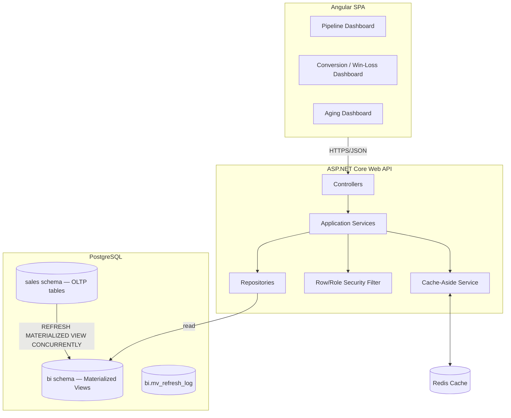

# Sale Quotation BI Module — Implementation Proposal

**Version:** 1.0
**Date:** 02 August 2026
**Scope:** Sale Quotations BI (Pipeline, Conversion/Win-Loss, Aging)
**Stack:** ASP.NET Core · Angular + AG Grid · PostgreSQL (Materialized Views) · Redis
**Source Spec:** `Sales_Delivery_Module_BI_Developer_Guidelines.md` (v1.0)

---

## 1. Executive Summary

This proposal defines the technical approach for building the BI/reporting layer for **Sale Quotations** — the entry point of the Sales & Delivery revenue pipeline. The system will give Commercial, Merchandising, and Management teams real-time visibility into open pipeline value, conversion rate, and aging risk, without touching or modifying the existing OLTP quotation entry process.

The design is a **read-optimized BI layer on top of the existing OLTP schema**: a PostgreSQL materialized view pre-aggregates quotation data, Redis caches query results per filter combination, and a thin ASP.NET Core API layer serves three Angular/AG Grid dashboards under role- and unit-based row-level security.

---

## 2. Scope & Objectives

| Item | Included |
|---|---|
| Materialized View | `MV_SALES_QUOTATION_SUMMARY` + 2 supporting MVs (pipeline daily snapshot, conversion rate) |
| Dashboards | Quotation Pipeline, Conversion & Win/Loss, Aging Analysis |
| API Endpoints | `pipeline`, `conversion`, `aging`, `{id}`, `summary` |
| Security | Role-based + unit-based row-level access |
| Caching | Redis cache-aside per dashboard |
| Executive Feed | 3 KPIs pushed to Executive Overview dashboard |

**Out of scope:**
- Quotation creation/edit UI (OLTP entry screens) — this is a reporting/BI layer only, reading from the existing transactional schema.
- Sales Order, Delivery, Invoice, and Return dashboards — not covered by this proposal; may be a separate future phase.

---

## 3. Business Process Coverage

```
Draft → Submitted → Under Negotiation → Approved → Converted to Sales Order
                 ↘ Rejected / Expired / Lost
```

Key questions this system must answer:
- How many quotations are pending approval, and what is their total value?
- What is the quotation-to-order conversion rate, by buyer/merchandiser/unit?
- Which quotations are aging (open too long) and at risk of being lost?

---

## 4. Solution Architecture



**Layering rule:** Controllers never touch `DbContext`/SQL directly. Controller → AppService → Repository → Dapper (read-only MV queries). DTOs cross the AppService boundary; entities never leave the repository layer.

---

## 5. Technology Stack

| Layer | Choice | Notes |
|---|---|---|
| Frontend | Angular 17+, AG Grid Community | Grid-heavy dashboards match AG Grid's strength |
| API | ASP.NET Core 8 | Async all the way, no `.Result`/`.Wait()` |
| Data access | Dapper (read-only MV queries) | MVs are flat/denormalized — avoids EF tracking overhead |
| Database | PostgreSQL 15+ | Native `MATERIALIZED VIEW`, `pg_cron` for scheduled refresh |
| Cache | Redis (StackExchange.Redis) | Cache-aside pattern, per-filter-hash keys |
| Auth | JWT bearer + policy-based authorization | Role claims + unit claims embedded in token |

---

## 6. Database Design

### 6.1 Assumed OLTP Source (existing transactional schema)

```sql
sales.quotations       (quotation_id PK, quotation_no, quotation_date, buyer_id FK,
                        merchandiser_id FK, unit_id FK, style_no, season,
                        currency_code, value, status, status_date,
                        converted_so_id FK NULL, converted_date NULL,
                        lost_reason NULL, created_by, created_at)
sales.buyers           (buyer_id PK, buyer_name)
sales.merchandisers    (merchandiser_id PK, merchandiser_name, unit_id FK)
sales.units            (unit_id PK, unit_name)
sales.user_units       (user_id FK, unit_id FK)   -- row-level security join
sales.fx_rates         (currency_code, rate_date, rate_to_usd)
```

### 6.2 Primary Materialized View

```sql
CREATE MATERIALIZED VIEW bi.mv_sales_quotation_summary AS
SELECT
    q.quotation_id, q.quotation_no, q.quotation_date,
    q.buyer_id, b.buyer_name,
    q.merchandiser_id, m.merchandiser_name,
    q.unit_id, u.unit_name,
    q.style_no, q.season, q.currency_code,
    q.value * fx.rate_to_usd AS quotation_value_usd,
    q.status, q.status_date,
    (CURRENT_DATE - q.status_date) AS days_in_status,
    (COALESCE(q.converted_date, CURRENT_DATE) - q.quotation_date) AS days_open,
    so.so_no AS converted_to_so_no, q.converted_date,
    (q.converted_date - q.quotation_date) AS conversion_days,
    q.lost_reason, q.created_by, now() AS last_refresh_date
FROM sales.quotations q
JOIN sales.buyers b ON b.buyer_id = q.buyer_id
JOIN sales.merchandisers m ON m.merchandiser_id = q.merchandiser_id
JOIN sales.units u ON u.unit_id = q.unit_id
LEFT JOIN sales.sales_orders so ON so.so_id = q.converted_so_id
LEFT JOIN sales.fx_rates fx ON fx.currency_code = q.currency_code
                             AND fx.rate_date = q.quotation_date;

CREATE UNIQUE INDEX ux_mv_quotation_summary ON bi.mv_sales_quotation_summary (quotation_id);
```

Two supporting MVs follow the same pattern:
- `mv_quotation_pipeline_daily` — daily snapshot of open pipeline value grouped by status/unit.
- `mv_quotation_conversion_rate` — monthly conversion % grouped by buyer/merchandiser/unit.

### 6.3 Refresh Strategy

- `REFRESH MATERIALIZED VIEW CONCURRENTLY` (requires the unique index above) so refresh never locks dashboards mid-read.
- Scheduled via `pg_cron` every 3 minutes for the primary MV, 15 minutes for the two supporting MVs.
- Every refresh writes to `bi.mv_refresh_log` (`mv_name, started_at, finished_at, status, rows_affected, error_message`) — this backs the "Data as of" timestamp shown on every screen.

**Open dependency:** FX conversion (`fx_rates`) source and ownership must be confirmed with Finance before sign-off — wrong USD values would silently mislead management KPIs.

---

## 7. API Design

```
GET /api/sales/quotations/pipeline
GET /api/sales/quotations/conversion
GET /api/sales/quotations/aging
GET /api/sales/quotations/{id}
GET /api/sales/quotations/summary
```

Common contract for every endpoint:
- Accepts `unitId` (nullable = "all assigned units"), `fromDate`, `toDate`.
- Server re-validates `unitId` against the caller's `user_units` claim — never trusts a client-supplied unit list.
- Returns `lastRefresh` (from `bi.mv_refresh_log`) alongside data.
- Served via cache-aside; cache key includes a hash of all filter parameters.

---

## 8. Security Plan

| Role | Quotation Access |
|---|---|
| SuperAdmin | Full, all units |
| GeneralManager | Full view + conversion analysis, all units |
| CommercialManager | Create/edit + all reports, assigned units |
| CommercialOfficer | Create/edit own + view team pipeline |
| Merchandiser | Own quotations + limited pipeline |
| FinanceManager | View only (value & conversion), all units |
| Viewer | Read-only summary |

**Row-level rule:** enforced in the repository layer, not the controller and not the client — every query joins against `sales.user_units` for the authenticated user, intersected with any `unitId` filter passed. A request for a unit outside the user's assignment returns `403`, not a silently empty result — a silent-empty response looks like a bug rather than a security boundary in production.

---

## 9. Caching Strategy

| Dashboard | TTL | Key Pattern |
|---|---|---|
| Quotation Pipeline | 3–5 min | `bi:sales:quotation:pipeline:unit:{id}:{date}` |
| Quotation Conversion | 10–15 min | `bi:sales:quotation:conversion:unit:{id}:{yyyy-mm}` |
| Quotation Aging | 5 min | `bi:sales:quotation:aging:unit:{id}` |

**Cache stampede protection:** when a hot key expires, concurrent requests must not all fall through to Postgres simultaneously — use a short-lived Redis lock (`SET key NX PX 2000`) around the recompute so losing requests wait/retry instead of all hitting the MV at once.

---

## 10. Risk / Bottleneck Analysis

| Risk | Impact | Mitigation |
|---|---|---|
| MV refresh without unique index | Refresh takes exclusive lock, dashboards hang | Unique index on every MV (built into DDL); enforce via migration review |
| Cache stampede on TTL expiry | Redis miss storm hits Postgres simultaneously under load | Redis `SET NX` short lock around recompute |
| Row-level filter enforced client-side only | User could tamper with `unitId` query param to see other units' data | Server re-validates `unitId` against `user_units` claim on every request, 403 on violation |
| FX conversion correctness | Wrong USD values silently mislead management KPIs | Confirm FX rate source/ownership with Finance before sign-off; snapshot rate at transaction date |
| Stale MV vs. real-time expectation | Users may assume dashboard is "live" | Mandatory "Data as of {lastRefresh}" on every screen, sourced from `bi.mv_refresh_log` |
| pg_cron job silently failing | Dashboards go stale with no alert | `bi.mv_refresh_log` failure rows feed an ops alert if `status='FAILED'` or overdue |

---

**End of Proposal**
